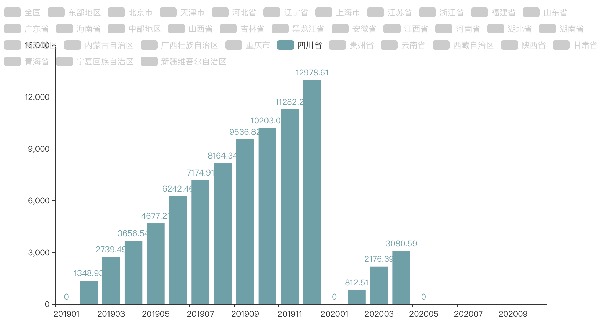

从 [data.stats.gov.cn](http://data.stats.gov.cn) 爬取一些数据

> 注: 通过实践发现: data.stats.gov.cn 存在 ip 频繁请求限制措施, 同一 ip 请求太过频繁会被禁止请求一段时间

- [各地区商品房销售面积增长情况](commercial_housing_sales_area.py)

对这个数据的疑惑可以参考: https://www.zhihu.com/question/401403763
